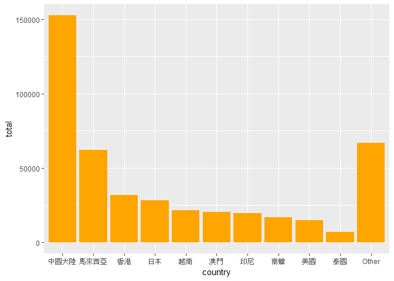
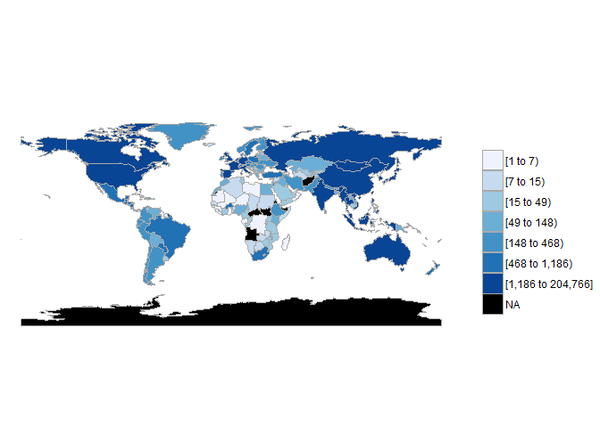
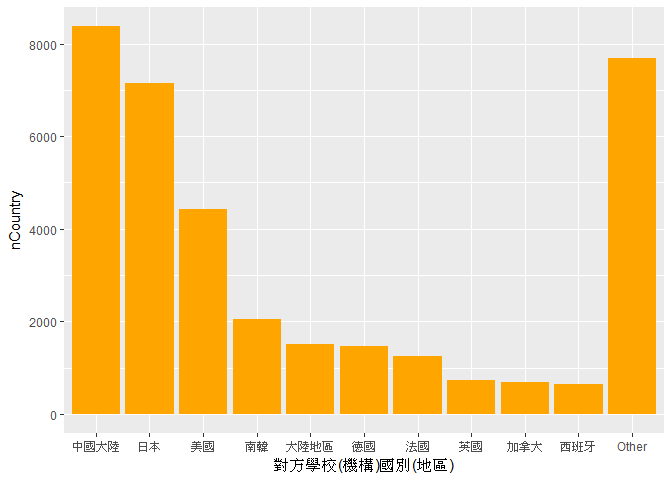
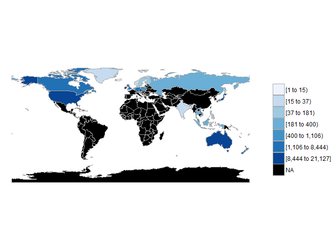
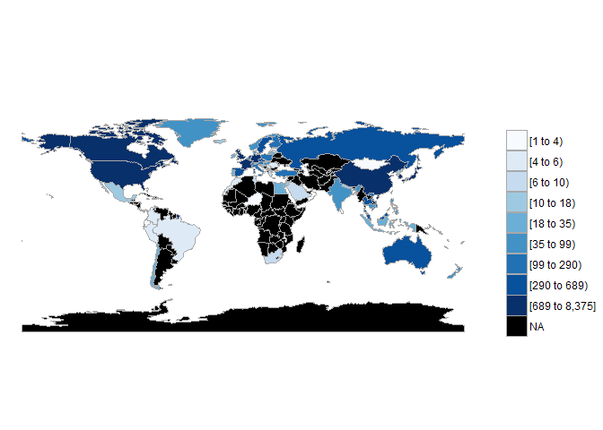

106-2 大數據分析方法 作業二
================
Yi-Ju Tseng

作業完整說明[連結](https://docs.google.com/document/d/1aLGSsGXhgOVgwzSg9JdaNz2qGPQJSoupDAQownkGf_I/edit?usp=sharing)

學習再也不限定在自己出生的國家，台灣每年有許多學生選擇就讀國外的大專院校，同時也有人多國外的學生來台灣就讀，透過分析[大專校院境外學生人數統計](https://data.gov.tw/dataset/6289)、[大專校院本國學生出國進修交流數](https://data.gov.tw/dataset/24730)、[世界各主要國家之我國留學生人數統計表](https://ws.moe.edu.tw/Download.ashx?u=C099358C81D4876CC7586B178A6BD6D5062C39FB76BDE7EC7685C1A3C0846BCDD2B4F4C2FE907C3E7E96F97D24487065577A728C59D4D9A4ECDFF432EA5A114C8B01E4AFECC637696DE4DAECA03BB417&n=4E402A02CE6F0B6C1B3C7E89FDA1FAD0B5DDFA6F3DA74E2DA06AE927F09433CFBC07A1910C169A1845D8EB78BD7D60D7414F74617F2A6B71DC86D17C9DA3781394EF5794EEA7363C&icon=..csv)可以了解103年以後各大專院校國際交流的情形。請同學分析以下議題，並以視覺化的方式呈現分析結果，呈現103年以後大專院校國際交流的情形。

來台境外生分析
--------------

### 資料匯入與處理

``` r
library(readr)
library(dplyr)
library(ggplot2)
C103<- read_csv("http://stats.moe.gov.tw/files/detail/103/103_ab103_C.csv")
U103<- read_csv("http://stats.moe.gov.tw/files/detail/103/103_ab103_S.csv")
C104<- read_csv("http://stats.moe.gov.tw/files/detail/104/104_ab104_C.csv")
U104<- read_csv("http://stats.moe.gov.tw/files/detail/104/104_ab104_S.csv")
C105<- read_csv("http://stats.moe.gov.tw/files/detail/105/105_ab105_C.csv")
U105<- read_csv("http://stats.moe.gov.tw/files/detail/105/105_ab105_S.csv")
C106<- read_csv("http://stats.moe.gov.tw/files/detail/106/106_ab105_C.csv")
U106<- read_csv("http://stats.moe.gov.tw/files/detail/106/106_ab105_S.csv")
```

### 哪些國家來台灣唸書的學生最多呢？

``` r
C103<-data.frame(country=C103$國別,people103=C103$`學位生-正式修讀學位外國生`+C103$`學位生-僑生(含港澳)`+C103$`學位生-正式修讀學位陸生`+
            C103$`非學位生-外國交換生`+C103$`非學位生-外國短期研習及個人選讀`+
            C103$`非學位生-大專附設華語文中心學生`+C103$`非學位生-大陸研修生`+
            C103$`非學位生-海青班`+C103$境外專班)

C104<-data.frame(country=C104$國別,people104=C104$`學位生-正式修讀學位外國生`+C104$`學位生-僑生(含港澳)`+C104$`學位生-正式修讀學位陸生`+
            C104$`非學位生-外國交換生`+C104$`非學位生-外國短期研習及個人選讀`+
            C104$`非學位生-大專附設華語文中心學生`+C104$`非學位生-大陸研修生`+
            C104$`非學位生-海青班`+C104$境外專班)
C103104<-full_join(C103,C104,by="country")

C105<-data.frame(country=C105$國別,people105=C105$`學位生_正式修讀學位外國生`+C105$`學位生_僑生(含港澳)`+C105$`學位生_正式修讀學位陸生`+
                   C105$`非學位生_外國交換生`+C105$`非學位生_外國短期研習及個人選讀`+
                   C105$`非學位生_大專附設華語文中心學生`+C105$`非學位生_大陸研修生`+
                   C105$`非學位生_海青班`+C105$境外專班)
C103104105<-full_join(C103104,C105,by="country")

C106<-data.frame(country=C106$國別,people106=C106$`學位生_正式修讀學位外國生`+C106$`學位生_僑生(含港澳)`+C106$`學位生_正式修讀學位陸生`+
                   C106$`非學位生_外國交換生`+C106$`非學位生_外國短期研習及個人選讀`+
                   C106$`非學位生_大專附設華語文中心學生`+C106$`非學位生_大陸研修生`+
                   C106$`非學位生_海青班`+C106$境外專班)
C103104105106<-full_join(C103104105,C106,by="country")
C103104105106[is.na(C103104105106)]=0
C103104105106$total<-C103104105106$people103+C103104105106$people104+C103104105106$people105+C103104105106$people106
C103104105106<-arrange(C103104105106,desc(C103104105106$total))
knitr::kable(C103104105106[1:10,c(1,6)])
```

| country  |   total|
|:---------|-------:|
| 中國大陸 |  152524|
| 馬來西亞 |   62031|
| 香港     |   31940|
| 日本     |   28200|
| 越南     |   21670|
| 澳門     |   20302|
| 印尼     |   19620|
| 南韓     |   16948|
| 美國     |   14846|
| 泰國     |    7035|

由上述圖表可知:<br>各個國家來台灣唸書的學生之前十名<br>1.中國大陸 2.馬來西亞 3.香港 4.日本 5.越南 6.澳門 7.印尼 8.南韓 9.美國 10.泰國

### 哪間大學的境外生最多呢？

``` r
U103$`非學位生-大陸研修生`<-gsub("…","0",U103$`非學位生-大陸研修生`)
U103$`非學位生-大陸研修生`<-as.numeric(U103$`非學位生-大陸研修生`)
U103<-data.frame(school=U103$學校名稱,people103=U103$`學位生-正式修讀學位外國生`+U103$`學位生-僑生(含港澳)`+U103$`學位生-正式修讀學位陸生`+
                   U103$`非學位生-外國交換生`+U103$`非學位生-外國短期研習及個人選讀`+U103$`非學位生-大專附設華語文中心學生`+
                   U103$`非學位生-大陸研修生`+U103$`非學位生-海青班`+U103$境外專班)

U104$`非學位生-大陸研修生`<-gsub("…","0",U104$`非學位生-大陸研修生`)
U104$`非學位生-大陸研修生`<-as.numeric(U104$`非學位生-大陸研修生`)
U104<-data.frame(school=U104$學校名稱,people104=U104$`學位生-正式修讀學位外國生`+U104$`學位生-僑生(含港澳)`+U104$`學位生-正式修讀學位陸生`+
                   U104$`非學位生-外國交換生`+U104$`非學位生-外國短期研習及個人選讀`+U104$`非學位生-大專附設華語文中心學生`+
                   U104$`非學位生-大陸研修生`+U104$`非學位生-海青班`+U104$境外專班)
U103104<-full_join(U103,U104,by="school")

U105$`非學位生_大陸研修生`<-gsub("…","0",U105$`非學位生_大陸研修生`)
U105$`非學位生_大陸研修生`<-as.numeric(U105$`非學位生_大陸研修生`)
U105<-data.frame(school=U105$學校名稱,people105=U105$`學位生_正式修讀學位外國生`+U105$`學位生_僑生(含港澳)`+U105$`學位生_正式修讀學位陸生`+
                   U105$`非學位生_外國交換生`+U105$`非學位生_外國短期研習及個人選讀`+U105$`非學位生_大專附設華語文中心學生`+
                   U105$`非學位生_大陸研修生`+U105$`非學位生_海青班`+U105$境外專班)
U103104105<-full_join(U103104,U105,by="school")

U106$`非學位生_大陸研修生`<-gsub("…","0",U106$`非學位生_大陸研修生`)
U106$`非學位生_大陸研修生`<-as.numeric(U106$`非學位生_大陸研修生`)
U106<-data.frame(school=U106$學校名稱,people106=U106$`學位生_正式修讀學位外國生`+U106$`學位生_僑生(含港澳)`+U106$`學位生_正式修讀學位陸生`+
                   U106$`非學位生_外國交換生`+U106$`非學位生_外國短期研習及個人選讀`+U106$`非學位生_大專附設華語文中心學生`+
                   U106$`非學位生_大陸研修生`+U106$`非學位生_海青班`+U106$境外專班)
U103104105106<-full_join(U103104105,U106,by="school")
U103104105106[is.na(U103104105106)]=0
U103104105106$total<-U103104105106$people103+U103104105106$people104+U103104105106$people105+U103104105106$people106
U103104105106<-arrange(U103104105106,desc(U103104105106$total))
knitr::kable(U103104105106[1:10,c(1,6)])
```

| school           |  total|
|:-----------------|------:|
| 無法區分校別     |  92586|
| 國立臺灣師範大學 |  22113|
| 國立臺灣大學     |  18199|
| 中國文化大學     |  16074|
| 銘傳大學         |  16057|
| 淡江大學         |  13887|
| 國立政治大學     |  11626|
| 國立成功大學     |  10982|
| 輔仁大學         |   9499|
| 逢甲大學         |   9474|

由上述圖表可知:<br>有92586人是無法區分校別,但還是有這些人存在<br>因此台灣的大學境外生最多之前十名為<br>1.無法區分校別 2.國立臺灣師範大學 3.國立臺灣大學 4.中國文化大學 5.銘傳大學 6.淡江大學 7.國立政治大學 8.國立成功大學 9.輔仁大學 10.逢甲大學

### 各個國家來台灣唸書的學生人數條狀圖

``` r
library(ggplot2)
C103104105106n<-C103104105106[,-c(2:5)]
groupcountry<-C103104105106n%>%
  group_by(country)%>%
  tally(total,sort=TRUE)%>%
  group_by(country = factor(c(country[1:10], rep("Other", n() -10)),
                       levels = c(country[1:10], "Other")))%>%
  tally(n)
colnames(groupcountry)<-c("country","total")
ggplot()+geom_bar(data=groupcountry,
                  aes(x=country,y=total),
                  stat = "identity",
                  fill = "orange")
```



由於國家數太多，因此將前十名以外的放在其他<br>由此圖可知，各個國家最喜歡來台灣唸書的學生為中國大陸的學生

### 各個國家來台灣唸書的學生人數面量圖

``` r
library(choroplethr)
countryname<-read_csv("CountriesComparisionTable.csv")
colnames(countryname)<-c("ISO3","English","country")
TotalCountry<-merge(C103104105106[,c(1,6)],countryname,by="country")
colnames(TotalCountry)<-c("country","value","ISO3","region")
TotalCountry[5,2]<-TotalCountry[5,2]+TotalCountry[91,2]+TotalCountry[159,2]
TotalCountry[107,2]<-TotalCountry[107,2]+TotalCountry[108,2]
TotalCountry<-TotalCountry%>%
  subset(region!="Unmatch")%>%
  subset(country!="索馬利蘭共和國")
ans3<-country_choropleth(TotalCountry)
ans3
```



由圖可知:<br>來台灣唸書的學生最多來自中國大陸

台灣學生國際交流分析
--------------------

### 資料匯入與處理

``` r
library(readr)
library(dplyr)
Student_RPT_07 <- read_csv("Student_RPT_07.csv")
```

### 台灣大專院校的學生最喜歡去哪些國家進修交流呢？

``` r
a<-subset(Student_RPT_07,`學年度`>102)%>%
  group_by(`對方學校(機構)國別(地區)`)%>%
  summarise(nCountry=sum(小計))
b<-arrange(a,desc(nCountry))
knitr::kable(b[1:10,])
```

| 對方學校(機構)國別(地區) |  nCountry|
|:-------------------------|---------:|
| 中國大陸                 |      8375|
| 日本                     |      7142|
| 美國                     |      4427|
| 南韓                     |      2050|
| 大陸地區                 |      1516|
| 德國                     |      1466|
| 法國                     |      1258|
| 英國                     |       742|
| 加拿大                   |       689|
| 西班牙                   |       642|

由上述圖表可知:<br>台灣大專院校的學生最喜歡去的國家前十名為<br> 1.中國大陸 2.日本 3.美國 4.南韓 5.大陸地區 6.德國 7.法國 8.英國 9.加拿大 10.西班牙

### 哪間大學的出國交流學生數最多呢？

``` r
c<-subset(Student_RPT_07,`學年度`>102)%>%
  group_by(`學校名稱`)%>%
  summarise(nSchool=sum(小計))
d<-arrange(c,desc(nSchool))
knitr::kable(d[1:10,])
```

| 學校名稱     |  nSchool|
|:-------------|--------:|
| 國立臺灣大學 |     2224|
| 淡江大學     |     2038|
| 國立政治大學 |     1876|
| 逢甲大學     |     1346|
| 元智大學     |     1106|
| 國立臺北大學 |      956|
| 國立交通大學 |      951|
| 東海大學     |      931|
| 東吳大學     |      873|
| 國立成功大學 |      846|

由上述圖表可知:<br>最多出國交流學生數的大學前十名為<br> 1.國立臺灣大學 2.淡江大學 3.國立政治大學 4.逢甲大學 5.元智大學 6.國立臺北大學 7.國立交通大學 8.東海大學 9.東吳大學 10.國立成功大學

### 台灣大專院校的學生最喜歡去哪些國家進修交流條狀圖

``` r
groupCountry1<-b%>%
  group_by(`對方學校(機構)國別(地區)`)%>%
  tally(nCountry,sort=TRUE)%>%
  group_by(`對方學校(機構)國別(地區)` = factor(c(`對方學校(機構)國別(地區)`[1:10], rep("Other", n() - 10)),
                       levels = c(`對方學校(機構)國別(地區)`[1:10], "Other")))%>%
  tally(n)
colnames(groupCountry1)<-c("對方學校(機構)國別(地區)","nCountry")
ggplot()+geom_bar(data=groupCountry1,
                  aes(x=`對方學校(機構)國別(地區)`,y=nCountry),
                  stat = "identity",
                  fill = "orange")
```



由於國家數太多，因此將前十名以外的放在其他<br>由此圖可知，台灣大專院校的學生最喜歡去的國家為中國大陸

### 台灣大專院校的學生最喜歡去哪些國家進修交流面量圖

``` r
countryname<-read_csv("CountriesComparisionTable.csv")
colnames(countryname)<-c("ISO3","English","中文")
outNum<-a
colnames(outNum)<-c("國名","count")
EoutNum<-merge(outNum,countryname,by.x="國名",by.y="中文")
colnames(EoutNum)<-c("國名","value","ISO3","region")
EoutNum<-EoutNum%>%
  subset(region!="Unmatch")
ans6<-country_choropleth(EoutNum,num_colors=9)
ans6
```


由圖可知:<br>台灣大專院校的學生最喜歡去的國家為中國大陸

台灣學生出國留學分析
--------------------

### 資料匯入與處理

``` r
library(readr)
library(dplyr)
library(ggplot2)
world<-read_csv("https://ws.moe.edu.tw/Download.ashx?u=C099358C81D4876CC7586B178A6BD6D5062C39FB76BDE7EC7685C1A3C0846BCDD2B4F4C2FE907C3E7E96F97D24487065577A728C59D4D9A4ECDFF432EA5A114C8B01E4AFECC637696DE4DAECA03BB417&n=4E402A02CE6F0B6C1B3C7E89FDA1FAD0B5DDFA6F3DA74E2DA06AE927F09433CFBC07A1910C169A1845D8EB78BD7D60D7414F74617F2A6B71DC86D17C9DA3781394EF5794EEA7363C&icon=..csv")
```

### 台灣學生最喜歡去哪些國家留學呢？

``` r
world$X4=NULL
world$X5=NULL
world$X6=NULL
world<-arrange(world,desc(world$總人數))
knitr::kable(world[1:10,c(2,3)])
```

| 國別     | 總人數 |
|:---------|:------:|
| 美國     |  21127 |
| 澳大利亞 |  13582 |
| 日本     |  8444  |
| 加拿大   |  4827  |
| 英國     |  3815  |
| 德國     |  1488  |
| 紐西蘭   |  1106  |
| 波蘭     |   561  |
| 馬來西亞 |   502  |
| 奧地利   |   419  |

由上圖可知:<br>台灣學生留學最喜歡去的國家之前十名為<br>1.美國 2.澳大利亞 3.日本 4.加拿大 5.英國 6.德國 7.紐西蘭 8.波蘭 9.馬來西亞 10.奧地利

### 台灣學生最喜歡去哪些國家留學面量圖

``` r
countryname<-read_csv("CountriesComparisionTable.csv")
colnames(countryname)<-c("ISO3","English","國別")
Eworld<-merge(world,countryname,by="國別")
colnames(Eworld)<-c("國名","洲別","value","ISO3","region")
ans8<-country_choropleth(Eworld)
ans8
```



由圖可知:<br>台灣學生留學最喜歡去的國家為美國

綜合分析
--------

請問來台讀書與離台讀書的來源國與留學國趨勢是否相同(5分)？想來台灣唸書的境外生，他們的母國也有很多台籍生嗎？請圖文並茂說明你的觀察(10分)。

第一題:

``` r
ggplot()+geom_bar(data=groupcountry,
                  aes(x=country,y=total),
                  stat = "identity",
                  fill = "orange")
```


各個國家來台灣唸書的學生人數之條狀圖

``` r
ggplot()+geom_bar(data=groupCountry1,
                  aes(x=`對方學校(機構)國別(地區)`,y=nCountry),
                  stat = "identity",
                  fill = "orange")
```


台灣大專院校的學生去各國家進修交流人數之條狀圖<br><br>由上述圖表可知，趨勢有些微的不同，只有中國、日本 、南韓、美國有在前十名 <br><br> 第二題:

``` r
knitr::kable(C103104105106[1:10,c(1,6)])
```

| country  |   total|
|:---------|-------:|
| 中國大陸 |  152524|
| 馬來西亞 |   62031|
| 香港     |   31940|
| 日本     |   28200|
| 越南     |   21670|
| 澳門     |   20302|
| 印尼     |   19620|
| 南韓     |   16948|
| 美國     |   14846|
| 泰國     |    7035|

來台灣唸書的境外生國家前10名

``` r
ans3
```


來台灣唸書的境外生面量圖

``` r
knitr::kable(b[1:10,])
```

| 對方學校(機構)國別(地區) |  nCountry|
|:-------------------------|---------:|
| 中國大陸                 |      8375|
| 日本                     |      7142|
| 美國                     |      4427|
| 南韓                     |      2050|
| 大陸地區                 |      1516|
| 德國                     |      1466|
| 法國                     |      1258|
| 英國                     |       742|
| 加拿大                   |       689|
| 西班牙                   |       642|

台灣大專院校學生去各國家的前10名

``` r
ans6
```



台灣大專院校學生去各國家的面量圖<br><br>由上述圖表可知，來台灣的中國學生很多，而去中國的台灣學生也很多
